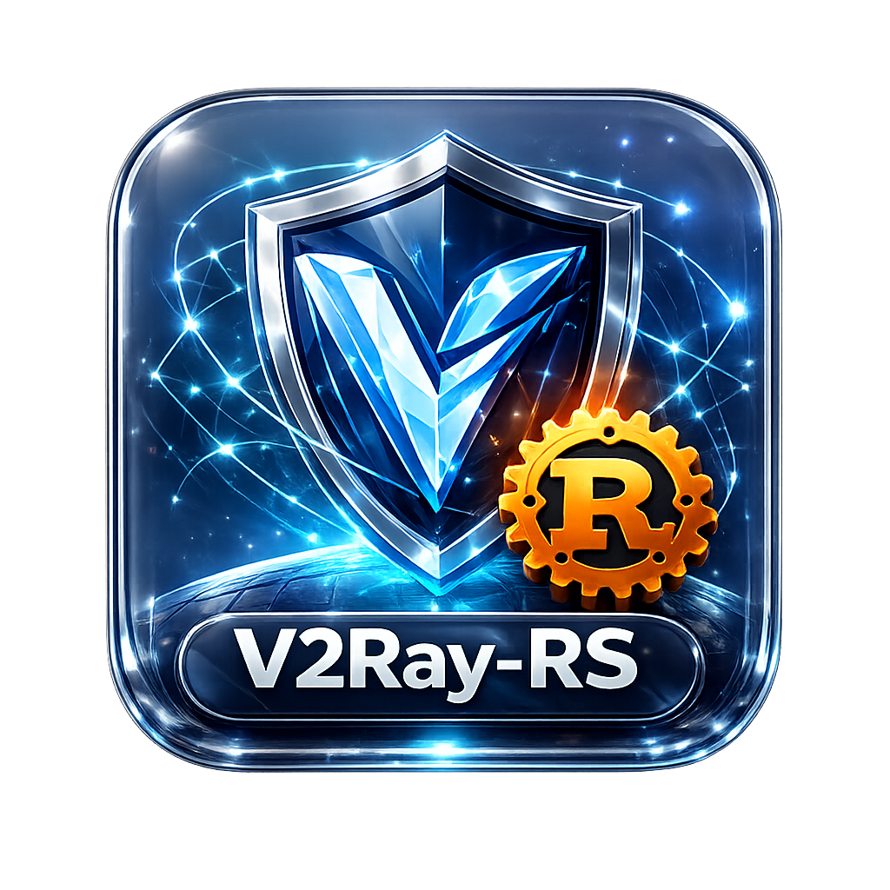

<div align="center">



# v2ray-rs

**A modern Linux desktop GUI for v2ray/xray/sing-box proxy management**

[](https://www.rust-lang.org/)
[](LICENSE)
[](https://github.com/victorzhuk/v2ray-rs/actions)

</div>

---

## Features

- **Multi-backend**: v2ray, xray, sing-box — auto-detected from system PATH
- **Subscriptions**: Fetch and parse from URLs or local files (VLESS, VMess, Shadowsocks, Trojan)
- **Routing rules**: GeoIP, GeoSite, domain patterns, IP CIDR with proxy/direct/block actions
- **Process management**: Async lifecycle with crash recovery, graceful shutdown, log capture
- **GTK4/libadwaita UI**: Native Linux desktop experience with system tray integration
- **XDG compliant**: Full XDG Base Directory layout with runtime profiles and per-directory overrides
- **Real Delay testing**: End-to-end latency probes through each proxy node. Supports sing-box with Clash API and xray/v2ray with ObservatoryService.

---

## Installation

### Arch Linux (AUR)

```bash
yay -S v2ray-rs
```

### From Source

```bash
# Dependencies (Debian/Ubuntu)
sudo apt install libgtk-4-dev libadwaita-1-dev

# Dependencies (Fedora)
sudo dnf install gtk4-devel libadwaita-devel

# Build
git clone https://github.com/victorzhuk/v2ray-rs.git
cd v2ray-rs
cargo build --release
```

You also need at least one proxy backend installed: `v2ray`, `xray`, or `sing-box`.

---

## Usage

1. Launch the app (or `cargo run -p v2ray-rs-ui` from source)
2. The onboarding wizard detects installed backends and guides initial setup
3. Add a subscription URL or local subscription file — nodes are fetched and parsed automatically
4. Enable desired nodes, configure routing rules, click **Connect**

### Real Delay

Real Delay measures the full proxy path by sending the configured test URL through each tested node. It is distinct from TCP ping and can be used for manual sorting or the Lowest Latency strategy.

Supported backends:
- sing-box with Clash API
- xray with ObservatoryService
- v2fly/v2ray-core with ObservatoryService

Privacy details: [`docs/real-delay-privacy.md`](docs/real-delay-privacy.md).

### Configuration

Settings are stored in `~/.config/v2ray-rs/settings.toml`:

```toml
version = 1
socks_port = 1080
http_port = 1081
auto_resolve_strategy = "last-successful"
auto_update_subscriptions = true
subscription_update_interval_secs = 86400
auto_update_geodata = true
geodata_update_interval_secs = 604800
language = "english"
minimize_to_tray = true
notifications_enabled = true
onboarding_complete = true

[backend]
backend_type = "xray"
binary_path = "/usr/bin/xray"

[dns]
enabled = false
```

### Runtime Profiles

The app supports isolated storage profiles so development, test, and production builds never share data:

| Profile | Qualifier | App ID | Default |
|---------|-----------|--------|---------|
| `production` | `v2ray-rs` | `com.github.v2ray-rs` | Release builds |
| `development` | `v2ray-rs-dev` | `com.github.v2ray-rs.dev` | Debug builds |
| `test` | `v2ray-rs-test` | `com.github.v2ray-rs.test` | — |
| `custom:<name>` | `v2ray-rs-<name>` | `com.github.v2ray-rs.<name>` | — |

Resolution order: `--profile` flag > `V2RAY_RS_PROFILE` env > `V2RAY_RS_DEV` env (deprecated) > compile-time default.

Per-directory overrides:

```bash
v2ray-rs --data-dir /tmp/scratch/data --cache-dir /tmp/scratch/cache
```

CLI flags and matching env vars: `--config-dir` (`V2RAY_RS_CONFIG_DIR`), `--data-dir`, `--cache-dir`, `--runtime-dir`, `--state-dir`.

To wipe a non-production profile and start fresh:

```bash
v2ray-rs --profile development --reset-instance
```

Production profiles require explicit confirmation:

```bash
v2ray-rs --profile production --reset-instance --i-understand
```

---

## Building & Testing

```bash
cargo check --workspace --all-targets       # type-check
cargo build --release         # release build
cargo test --workspace --all-targets        # all tests
cargo clippy --workspace --all-targets --all-features -- -D warnings
cargo fmt --all               # format
```

Or via Makefile: `make build`, `make test`, `make lint`, `make fmt`.

---

<div align="center">


[v2ray](https://github.com/v2fly/v2ray-core) / [xray](https://github.com/XTLS/Xray-core) / [sing-box](https://github.com/SagerNet/sing-box) / [Relm4](https://github.com/Relm4/Relm4) / [v2fly GeoIP/GeoSite](https://github.com/v2fly/geoip)

</div>
